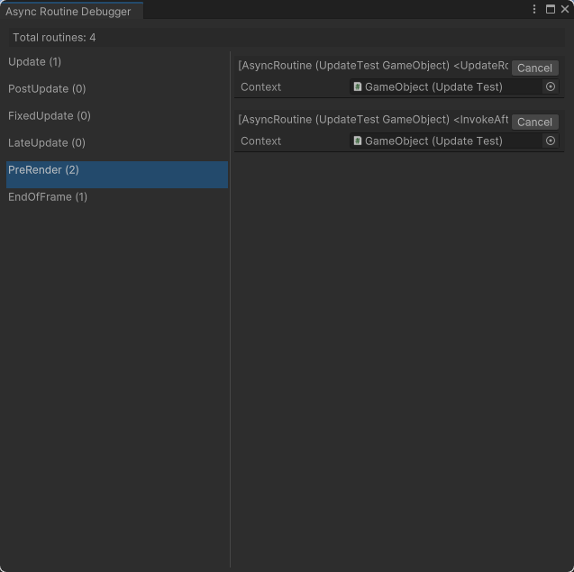

# Async Routines
This library provides a full C#-based replacement for Unity's built-in coroutines. It provides a number of vital features that Unity's coroutines do not, including:

* Receive callbacks when coroutines complete or are canceled
* Invoke coroutines on any Unity `Behaviour` class, not just `MonoBehaviour`.
* Invoke static coroutines without a `Behaviour` at all
* Pause coroutines when the invoking component gets disabled, rather than canceling them silently
* Yield coroutines until addition update phases (`PostUpdate`, `PreRender`)
* Run coroutines in the editor using the exact same logic used in play mode
* Run coroutines in unit tests
* One-line helper methods for delaying code until later in the frame
* One-line helper methods for queuing a callback to be called at a fixed framerate (essentially allowing you to replace `Update()` and similar methods entirely!)

## Installation
Async Routines relies on my [Promises](https://github.com/jonagill/Promises) library for providing callbacks when routines complete. We recommend you install both libraries via [OpenUPM](https://openupm.com/packages/com.jonagill.asyncroutines/). Per OpenUPM's documentation:

1. Open `Edit/Project Settings/Package Manager`
2. Add a new Scoped Registry (or edit the existing OpenUPM entry) to read:
    * Name: `package.openupm.com`
    * URL: `https://package.openupm.com`
    * Scope(s): `com.jonagill.asyncroutines` and `com.jonagill.promises`
3. Click Save (or Apply)
4. Open Window/Package Manager
5. Click the + button
6. Select `Add package by name...` or `Add package from git URL...`
6. Click Add

# Setup
Async routines require an instance of the `AsyncRoutineUpdater` component to exist in any scene where you want routines to get updated. You should generally add an instance of this component marked as `DontDestroyOnLoad` to your root scene or core systems prefab.

Coroutines run in Edit mode do not require the `AsyncRoutineUpdater` component, as they are updated separately via the static `EditorAsyncRoutineUpdater` class.

# Running coroutines
Async routines function a lot like Unity's built-in coroutines, but they must return an `IEnumerator<IYieldInstruction>` instead of `IEnumerator`. A simple async routine might look like this:

```
IEnumerator<IYieldInstruction> WaitOneFrame() 
{
    yield return AsyncYield.NextUpdate;
    Debug.Log("Complete!");
}
```

You would then invoke your routine using the `AsyncRoutine.Run()` function:

```
AsyncRoutine.Run(WaitOneFrame());
```

By default, this invokes your routine without a context Behaviour. This means that the routine is not tied to any GameObject or component and will run until it completes or is manually canceled.

To invoke a routine with a context Behaviour, you can call:

```
AsyncRoutine.Run(myBehaviour, WaitOneFrame());
```

When invoking a routine from within a MonoBehaviour class, you can also invoke a routine via a handy helper method (see Helper Methods below):

`this.RunRoutine(WaitOneFrame());`

When a routine is invoked with a context Behaviour, it will automatically pause whenever that Behaviour or its GameObject is disabled. Note that this differs from the behavior of Unity coroutines, which cancel the coroutine outright when the context GameObject is disabled.

# Yields
This library provides a variety of different `IYieldInstructions` that you can use to yield the execution of your routine until a later time. These yields should generally be accessed via the static `AsyncYield` class, which provides helpful, pre-cached accessors for all of the common yield types.

Available yields include:
* `NextUpdate`, `NextPostUpdate`, `NextFixedUpdate`, `NextLateUpdate`, `NextPreRender`, and `NextEndOfFrame`, which yield until the next tick of the given phase of Unity's update loop.
* `Wait(float seconds)`, which yields until the given number of seconds have passed.
* `WaitRealtime(float seconds)`, which yields until the given number of seconds have passed in real time (ignore Unity's `Time.timescale`).
* `WaitFrames(int frames)`, which yields until the given number of frames have passed.
* `Until(Func<bool> condition)`, which yields until the given condition function returns true.
* `WaitForPromise(IPromise promise)`, which yields until the given promise is no longer pending.

# Tracking and cancelling routines
All of these methods return an `IAsyncRoutinePromise` that represents the status of your active routine. This implements the full `ICancelablePromise` interface from the [Promises library](https://github.com/jonagill/Promises) and can be used to both check the status of your routine and to force it to cancel itself early.

To see if your routine is still running, check `routinePromise.IsPending`.

To see if your promise completed successfully, check `routinePromise.HasSucceeded`.

To see if your promise threw an exception, check `routinePromise.HasException`.

To see if your routine has been canceled, check `routinePromise.IsCanceled`.

To cancel your routine, call `routinePromise.Cancel()`.

# Receiving callbacks
As `IAsyncRoutinePromise` implemented the full promise API, you can also use the `Then()`, `Catch()`, `Canceled()` and `Finally()` methods to subscribe to callbacks for when your promise completes in various ways. For instance:

```
this.RunRoutine(MyRoutine())
    .Then(() => Debug.Log("Routine finished!"))
    .Catch(exception => Debug.LogException(exception))
    .Canceled(() => Debug.Log("Routine was canceled."))
    .Finally(() => PerformCleanup());
```

The `Finally()` method can be particularly useful, as you can use it to guarantee that important cleanup or teardown logic runs regardless of how your routine exits.

# Helper methods
In addition to `RunRoutine()`, the `AsyncRoutine` class provides a number of helper methods for performing common actions without having to write a custom routine.

## Queuing callbacks
* `InvokeNextUpdate()`, `InvokeNextFixedUpdate()`, etc. queue a callback to be invoked in the next tick of the given phase of Unity's update loop.
* `InvokeInUpdate()`, `InvokeInFixedUpdate()`, etc. queue a callback to be invoked in the given update phase after a certain number of seconds have passed.

These functions are available statically via `AsyncRoutine` or through the extension methods on Behaviour, accessible by calling `this.QueueUpdate()` within a MonoBehaviour class. The extension methods will all pass in the given Behaviour as the context, causing the queued callback to be canceled automatically if your Behaviour gets destroyed.

## Queueing updates
More interestingly, the `QueueUpdate()` family of functions can be used to queue a piece of code to be invoked repeatedly at a given frequency. 

By providing a custom update phase to `QueueUpdate()`, you can choose to run your update in any of the update loop phases supported by `AsyncYield`.

By providing a `targetRateHz` value, the async routine system will try to run your update at the given framerate rather than at Unity's internal update rate. This can be an excellent optimization for code that does not need to run at render framerate, such as pathfinding code.

Finally, by specifying `randomizeStartTime` as true, the async routine system will perform the initial tick of your update sometime randomly within your target updatee rate window. This is important when a lot of objects are updating at the same target rate. If you do not randomize the start times, all of your objects that were instantiated at the same time (such as on scene load) will consistently update on the same frame as well. This will cause large spikes in your CPU usage and potentially cause hitches in framerate that are visible to your players.

A number of helper methods are provided with common target framerates, such as `QueueUpdate30Hz()` (which updates at 30 frames per second) and `QueueUpdate1Hz` (which updates once per second).

Each of these methods return an `IDisposable` token that you can call `Dispose()` on when you want to cancel your update.

These functions are available via `AsyncRoutine.QueueUpdate()` or through the extension methods on Behaviour, accessible by calling `this.QueueUpdate()` within a MonoBehaviour class. The extension methods will all pass in the given Behaviour as the context, causing the queued update to be canceled automatically if your Behaviour gets destroyed.

### QueueUpdate() vs Update()
The `QueueUpdate()` pattern essentially allows you to stop using Unity's built-in `Update()`, `FixedUpdate()`, and `LateUpdate()` functions entirely. This is great, as it is [well-documented](https://blog.unity.com/technology/1k-update-calls) that overuse of Unity's built-in update functions can be terrible for performance. While queuing your own manual updates is not going to be as efficient as, say, rewriting all of your code to use a cache-coherent [Entity Component System](https://en.wikipedia.org/wiki/Entity_component_system), it does allow you to optimize certain cases, such as when your code does not need to run every frame (as described above), or when your code often early-outs based on some condition. For instance, when using the traditional `Update()` methods, you might write code like this:

```
public bool IsJumping { get; set; }

public void Update() 
{
    if (!IsJumping) 
    {
        return;
    }
        
    // Run jump logic
}
```

While this might not seem inefficient, it is quite costly for Unity to manage all the objects that have `Update()` methods specified and call `Update()` on every one of them. If you have hundreds or thousands of objects with this function, most of which are not jumping at any one time, the costs can really add up!

This code can be re-written using `QueueUpdate()` like so:

```
private IDisposable _jumpUpdate;
private bool _isJumping;
public bool IsJumping 
{ 
    get => _isJumping;
    set 
    {
        if (_isJumping != value)
        {
            // Cancel any active queued update
            _jumpUpdate?.Dispose();
            _isJumping = value;

            if (_isJumping) 
            {
                _jumpUpdate = this.QueueUpdate(UpdateJump);
            }
        }
    }
}

public void UpdateJump() 
{
    // Run jump logic
}

```

While this is a little more boilerplate, it means that `UpdateJump()` is only ever called for the objects that are actually jumping, which can save you a lot of CPU time that would otherwise have been wasted.

# Debugging async routines
The async routine library provides a debug window to help you understand what routines are currently running in your game.

To open the window, navigate to `Window > Async Routines > Debugger Window`.



The left column lists all of the phases of the update loop and the number of routines currently yielded to run in that phase. The right column lists all of the routines running in the selected phase.

By mousing over the name of the routine, you can see information such as the function that is being yielded and the context object it is running on. You can also click on the context object (if present) to select it in the Hierarchy view or press the Cancel button to forcibly cancel a running routine.

Please note that the debugger window is only available on Unity 2022.1 and above, as it relies on newer features of Unity's UI Toolkit library.

# Running routines in editor

You can invoke async routines to run in Edit mode using the exact same functions that you use to trigger Play mode routines. However, as Edit mode does not run the full Unity update loop, all of the update phases (`Update`, `LateUpdate`, `PreRender`, `EndOfFrame`, etc.) are invoked one after another in the same callback from `EditorApplication.update`. You can check out `EditorAsyncRoutineUpdater.cs` for more details about how Edit mode routines are implemented.

Please note that all routines are forcibly canceled when transitioning between Edit mode and Play mode.

# Testing async routines

By default, all async routines are queued onto a default, static instance of `AsyncRoutineRunner` (which manages the lifecycle of each routine), which is then automatically updated by either `AsyncRoutineUpdater` (in Play mode) or `EditorAsyncRoutineUpdater` (in Edit mode). This is not ideal for unit testing, where you want exact control over the entire execution of your test to ensure reliable results.

However, there is nothing stopping you constructing your own `AsyncRoutineRunner`, queuing your async routines on it directly, and manually updating it as part of your unit test. This is the approach taken in the unit tests used in the development of this package.

An example unit test might look something like this:

```
public class MyAsyncBehaviourTests
{
    private AsyncRoutineRunner runner;
    private MockTimeProvider timeProvider;
    private MyAsyncBehaviour behaviour;
    
    [SetUp]
    public void Setup()
    {
        runner = new AsyncRoutineRunner();

        // In order to control how our IYieldInstructions interpret time, we have to 
        // create and push our own time provider to override the default time values
        timeProvider = new MockTimeProvider();
        AsyncYield.PushTimeProvider(timeProvider);

        behaviour = new GameObject("TestObject").AddComponent<MyAsyncBehaviour>();
    }

    [TearDown]
    public void Teardown()
    {
        runner.Dispose();
        AsyncYield.RemoveTimeProvider(timeProvider);
        
        if (behaviour != null)
        {
            Object.DestroyImmediate(behaviour.gameObject);   
        }
    }

    [Test]
    public void TestAsyncBehavior()
    {
        var routinePromise = runner.Run(behaviour.DoThingAsync());
        Assert.IsFalse(behaviour.IsTheThingDone)
        
        // Advance time as necessary for our yield statement
        timeProvider.Time = 1.5f;

        // Update whichever phase we are yielding to
        runner.StepRoutines(UpdatePhase.Update);
        
        Assert.IsTrue(behaviour.IsTheThingDone);
    }
}

```


